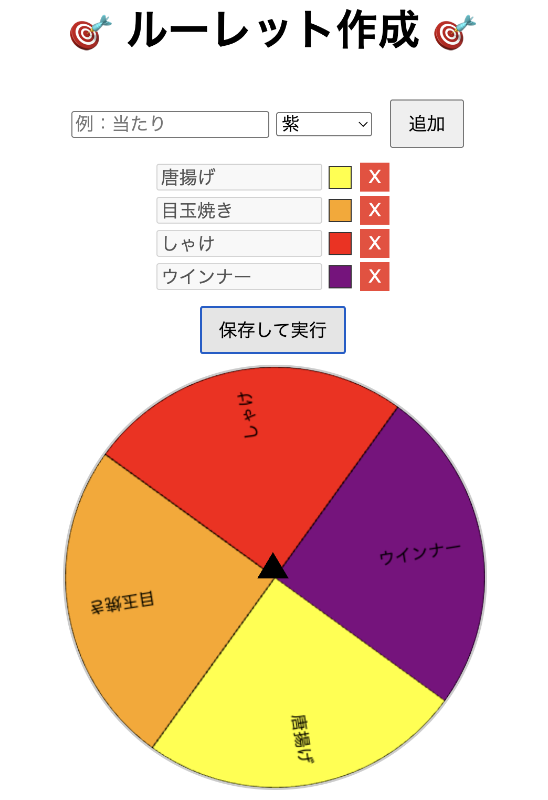

# 🎯 カスタムルーレットアプリ

JavaScriptで作成した、シンプルかつカスタマイズ可能なルーレットアプリです。  
入力した項目がランダムに選ばれ、当たりを針（インジケーター）で表示します。

---

## 🚀 主な機能

- 入力欄から自由に項目を追加
- ルーレットのアニメーション表示（CSSで回転）
- 当たり判定機能付きの針（インジケーター）
- 選ばれた項目の表示
- カラーリングはプリセットの基本色を選択可能

---

## 🖥️ 使用技術

- HTML / CSS / JavaScript（Vanilla JS）
- DOM操作とCSSアニメーションを活用

---

## 📦 ファイル構成
roulette-app/
├── index.html # ルーレットのUIと構造
├── style.css # 見た目のスタイル（オプションで外部化）
├── script.js # ルーレットの動きと当たり判定
├── screenshot.png # アプリのスクリーンショット（任意）
└── README.md # このファイル

---

## ✅ 使い方

1. このリポジトリをクローンまたはZIPでダウンロード
2. `index.html` をブラウザで開く
3. 入力欄にルーレットの項目をカンマ区切りで入力
4. 「回す」ボタンをクリック
5. 当たりが針の位置で表示されます！

---

## 🔧 カスタマイズ例

- ルーレットの色パターンを増やす
- スマホ対応のUIに変更
- 効果音を追加
- 当選履歴を記録する機能の追加

---

## 📸 スクリーンショット（任意）

---

## 📄 ライセンス

---

## 🙌 作者

- https://github.com/atakuya-12915

