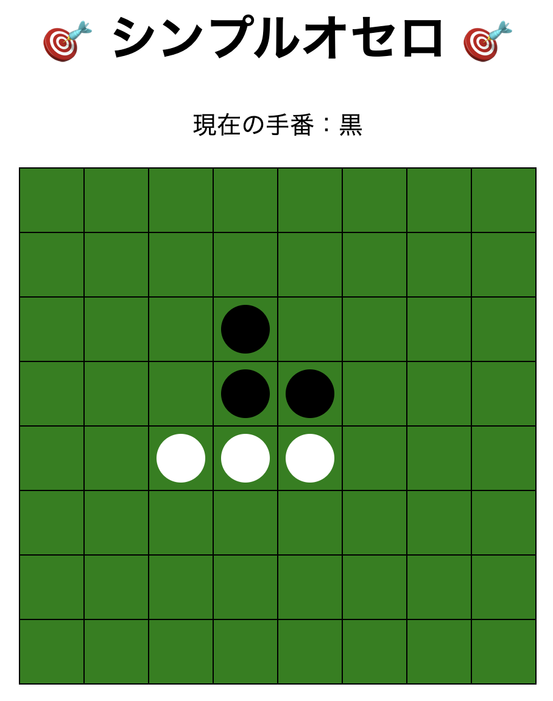

# ⚫️ 簡易リバーシゲーム

JavaScriptで作成した、シンプルなリバーシアプリを作成中です。
※言語学習中のため、わからない部分はchatGPTを頼って実装しています。



---

## 🚀 主な機能

- 初期配置あり（中央に黒白2つずつ）
- 現在の手番を表示（自分が白or黒）
- 黒→白→黒と交互に打てる
- 周囲にある石をひっくり返すロジックが動く
- 実際の盤面のようなデザイン

---

## 🖥️ 使用技術

- HTML / CSS / JavaScript（Vanilla JS）
- DOM操作とCSSアニメーションを活用

---

## 4.ディレクトリ構成

```
.
└── reversi/
    ├── index.html
    ├── style.css
    ├── script.js
    ├── reversi.png
    └── README.md
```

---

## ✅ 使い方

1. このリポジトリをクローンまたはZIPでダウンロード
2. `index.html` をブラウザで開く
3. 実際のリバーシのやり方で相手の色の石を挟む

---

## 🔧 カスタマイズ例

- スマホ対応
- UIをもっと綺麗に（アニメーションや色など）
- CPU対戦（初級AIでOK）
- Reactでコンポーネント化（再利用・状態管理・保守性向上）

---

## 📸 スクリーンショット（任意）

---

## 📄 ライセンス

---

## 🙌 作者

- https://github.com/atakuya-12915

